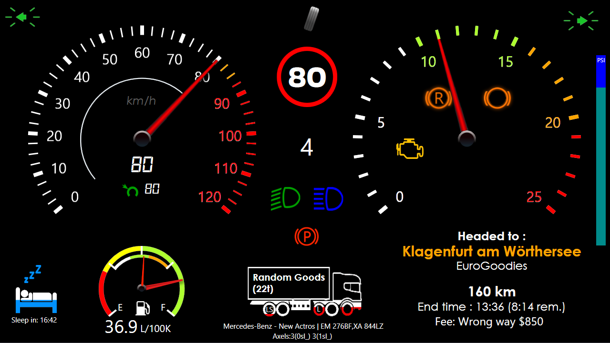

# A SimHub Dashboard for ETS2

A SimHub dashboard intended for Euro Truck Simulator 2 telemetry.

## Installation Guide

* **Download and install the latest release of [SimHub](https://www.simhubdash.com/)**

* Download the [dash](ETS2Simple.simhubdash) file
* Import the file into SimHub
* Adjust the dashboard variable for Crawler gears, if your transmission has them, or use 0 if it does not.
* Enjoy.

## Dashboard screenshots

## Features

* Lists your current freight and it's weight
* Time until end-of-job
* Time until next rest stop
* Indicates if your truck and trailer have liftable and steerable axels
* Indicates graphically if your liftable axels are lifted
* Speed gauge knows about speed limit and adjusts coloration accordingly 
* Combined fuel and consumption gauges
* Break PSI gauge
* Steering angle indicator which I find useful while trying to reverse
* Gear indicator which can be configured to display crawler gears and multiple reverse gears correctly
* Gauges dim to indicate electricity/engine are off
* Indicators for Cruise set and speed, low and high beams, parking break, retarder, engine break, check engine light, speed limit, and turn signals

## Todo

* Have RPM gauge adjust green, yellow, red lines automatically
  * Need to investigate GameRawData.TruckValues.ConstantsValues.MotorValues.EngineRpmMax and GameData.CarData.CarSettings_CurrentGearRedLineRPM and other data points
  * Possibly make it a dashboard variable, like crawler gears
* Buy American Truck Simulator and see what needs to be changed to work there? Graphic and units changes, of course
* Make configurable for Metric/English units?
* Test with makes and models of trucks:
  * Renault -T
  * Mercedes - New Actros
* Odometer/Trip?

## What's outright not working, impossible, or problematic

* At this point, I'm still working on getting the fee/toll/ferry/train display to work
  *  Currently it hides itself completely, all the time
  *  It should show itself for a period of time after any of those events happen
  *  Investigations continue as to why it does not
*  I'm not exactly happy with the way I'm indicating Liftable and Steerable axels on the truck/trailer graphics (LS text over wheels)
*  Nor that the liftable axels don't color code correctly
*  Does not appear to be possible to display hired driver income or bank payments
* Consumption value is litrers/100Km average since trip reset
  *  Would have liked to do an immediate consumption value instead/in addition, but ETS2 does not export that value that I could find
  *  Does this change based on the make/model? Possibly, had to add an inertia() function with the New Actros to prevent it from having odd jitter
